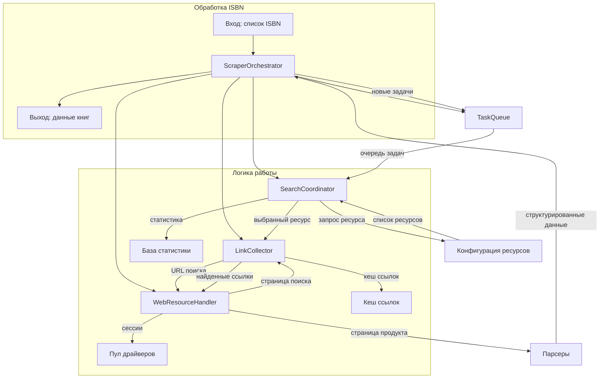

# Схема взаимодействия компонентов оркестрационного слоя

## Обзор
Данная схема описывает взаимодействие компонентов оркестрационного слоя в рамках итерации A (базовый оркестрационный слой).

## Компоненты

### 1. ScraperOrchestrator
Главный координатор, управляющий всем процессом скрапинга:
- Инициализирует все компоненты
- Управляет жизненным циклом задач
- Координирует взаимодействие между компонентами

### 2. SearchCoordinator
Координатор поиска, отвечающий за:
- Приоритизацию ресурсов на основе истории успешности
- Балансировку нагрузки между ресурсами
- Выбор следующего ресурса для задачи
- Отслеживание статистики выполнения

### 3. LinkCollector
Сборщик ссылок, отвечающий за:
- Извлечение ссылок на продукты со страниц поиска
- Фильтрацию дубликатов ссылок
- Валидацию URL (преобразование относительных в абсолютные)
- Передачу найденных ссылок WebResourceHandler

### 4. WebResourceHandler
Обработчик веб-ресурсов, отвечающий за:
- Загрузку страниц через Selenium или requests
- Извлечение данных со страниц продуктов
- Обработку ошибок на уровне ресурса
- Возврат сырых данных парсерам

### 5. TaskQueue (планируется)
Очередь задач с приоритетами, отвечающая за:
- Управление очередями задач с разными приоритетами
- Чередование ресурсов для предотвращения блокировок
- Статистику выполнения задач

## Диаграмма взаимодействия



## Последовательность выполнения

1. **Инициализация**:
   - `ScraperOrchestrator` создает экземпляры `SearchCoordinator`, `LinkCollector`, `WebResourceHandler`
   - Загружается конфигурация ресурсов
   - Инициализируется `TaskQueue` (если реализована)

2. **Обработка ISBN**:
   - ISBN добавляются в `TaskQueue` с приоритетами
   - `ScraperOrchestrator` извлекает задачи из очереди
   - Для каждой задачи запрашивает у `SearchCoordinator` подходящий ресурс

3. **Поиск ссылок**:
   - `ScraperOrchestrator` передает ISBN и выбранный ресурс в `LinkCollector`
   - `LinkCollector` использует `WebResourceHandler` для загрузки страницы поиска
   - Извлекает ссылки на продукты с использованием селекторов ресурса
   - Фильтрует дубликаты и валидирует URL

4. **Извлечение данных**:
   - Найденные ссылки передаются обратно в `ScraperOrchestrator`
   - `ScraperOrchestrator` использует `WebResourceHandler` для загрузки страниц продуктов
   - Данные передаются парсерам для структурирования
   - Результаты возвращаются вызывающей стороне

5. **Обновление статистики**:
   - `SearchCoordinator` обновляет статистику успешности ресурсов
   - `LinkCollector` обновляет кеш ссылок
   - `TaskQueue` обновляет статистику выполнения задач

## Интерфейсы взаимодействия

### SearchCoordinator → LinkCollector
```python
class SearchCoordinator:
    def get_next_resource(self, isbn: str) -> Dict[str, Any]:
        """Возвращает конфигурацию ресурса для обработки ISBN"""
```

### LinkCollector → WebResourceHandler
```python
class LinkCollector:
    async def collect_links(self, isbn: str, resource_config: Dict[str, Any]) -> List[str]:
        """Собирает ссылки на продукты для заданного ISBN и ресурса"""
```

### WebResourceHandler → LinkCollector/ScraperOrchestrator
```python
class WebResourceHandler:
    async def fetch_page(self, url: str) -> str:
        """Загружает страницу и возвращает HTML"""
    
    async def extract_data(self, url: str) -> Dict[str, Any]:
        """Извлекает данные со страницы продукта"""
```

### ScraperOrchestrator → TaskQueue
```python
class ScraperOrchestrator:
    async def process_isbns(self, isbn_list: List[str]) -> List[Optional[Dict[str, Any]]]:
        """Основной метод обработки списка ISBN"""
```

## Конфигурация

### Файлы конфигурации:
- `config/scraper_config.json` - общие настройки скрапинга
- `config/resources_config.json` - конфигурация ресурсов
- `scraper_core/config/schemas/` - схемы валидации конфигурации

### Ключевые параметры:
- `max_concurrent_tasks` - максимальное количество параллельных задач
- `resource_priority_weights` - веса приоритетов ресурсов
- `link_cache_ttl` - время жизни кеша ссылок
- `retry_policy` - политика повторных попыток

## Обработка ошибок

1. **Ошибки ресурсов**:
   - `SearchCoordinator` отмечает ресурс как проблемный
   - Выбирается альтернативный ресурс
   - Статистика обновляется для будущих решений

2. **Ошибки ссылок**:
   - `LinkCollector` пропускает невалидные ссылки
   - Логируются проблемы с селекторами
   - При отсутствии ссылок возвращается пустой список

3. **Ошибки загрузки**:
   - `WebResourceHandler` повторяет попытки согласно политике
   - При превышении лимита попыток возвращается `None`
   - Ошибки логируются для анализа

## Тестирование

### Unit-тесты:
- `tests/test_search_coordinator.py` - тесты `SearchCoordinator`
- `tests/test_link_collector.py` - тесты `LinkCollector` (будет создан)
- `tests/test_web_handler.py` - тесты `WebResourceHandler`

### Интеграционные тесты:
- `tests/test_orchestrator_integration.py` - полный цикл обработки
- `tests/test_scraping_all.py` - тестирование на реальных данных

## Следующие шаги

1. Реализация `LinkCollector` согласно определенному интерфейсу
2. Интеграция `LinkCollector` с `WebResourceHandler`
3. Реализация `TaskQueue` с поддержкой приоритетов
4. Полное тестирование взаимодействия компонентов
5. Документация API каждого компонента