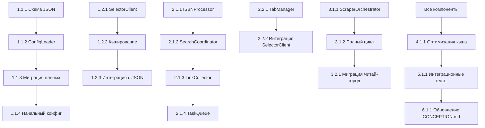

# Этапы реализации и подзадачи

## Общий план реализации

### Фаза 1: Подготовка инфраструктуры (Неделя 1)
**Цель**: Создать основу для новой архитектуры без нарушения существующей функциональности.

#### Этап 1.1: JSON-конфигурация
- [ ] **Задача 1.1.1**: Создать схему JSON-конфига (`config_schema.py`)
- [ ] **Задача 1.1.2**: Реализовать `ConfigLoader` для загрузки и валидации конфига
- [ ] **Задача 1.1.3**: Создать скрипт миграции текущих данных в JSON-формат
- [ ] **Задача 1.1.4**: Создать начальный `resources_config.json` на основе текущих данных
- [ ] **Задача 1.1.5**: Реализовать утилиты для обновления конфига

#### Этап 1.2: Движок селекторов
- [ ] **Задача 1.2.1**: Создать `SelectorClient` как обертку над `debug_selectors`
- [ ] **Задача 1.2.2**: Реализовать кэширование паттернов в памяти
- [ ] **Задача 1.2.3**: Интегрировать загрузку селекторов из JSON-конфига
- [ ] **Задача 1.2.4**: Реализовать механизм fallback при отсутствии селекторов
- [ ] **Задача 1.2.5**: Создать тесты для `SelectorClient`

### Фаза 2: Рефакторинг оркестрационного слоя (Неделя 2)
**Цель**: Создать новый оркестрационный слой, сохраняя обратную совместимость.

#### Этап 2.1: Базовые компоненты
- [ ] **Задача 2.1.1**: Создать `ISBNProcessor` для обработки ISBN
- [ ] **Задача 2.1.2**: Реализовать `SearchCoordinator` для координации поиска
- [ ] **Задача 2.1.3**: Создать `LinkCollector` для сбора и балансировки ссылок
- [ ] **Задача 2.1.4**: Реализовать `TaskQueue` с чередованием ресурсов
- [ ] **Задача 2.1.5**: Создать `RetryHandler` для обработки ошибок

#### Этап 2.2: Управление вкладками
- [ ] **Задача 2.2.1**: Реализовать `TabManager` на основе логики `async_parallel_search`
- [ ] **Задача 2.2.2**: Интегрировать `SelectorClient` в процесс парсинга
- [ ] **Задача 2.2.3**: Реализовать мониторинг состояния вкладок
- [ ] **Задача 2.2.4**: Создать механизм балансировки нагрузки между вкладками
- [ ] **Задача 2.2.5**: Реализовать graceful shutdown вкладок

### Фаза 3: Интеграция и миграция (Неделя 3)
**Цель**: Интегрировать новые компоненты и начать миграцию с текущей системы.

#### Этап 3.1: Главный оркестратор
- [ ] **Задача 3.1.1**: Создать `ScraperOrchestrator` как точку входа
- [ ] **Задача 3.1.2**: Реализовать полный цикл обработки ISBN
- [ ] **Задача 3.1.3**: Интегрировать все компоненты в единый поток
- [ ] **Задача 3.1.4**: Реализовать конфигурирование через JSON
- [ ] **Задача 3.1.5**: Создать CLI-интерфейс для оркестратора

#### Этап 3.2: Миграция ресурсов
- [ ] **Задача 3.2.1**: Мигрировать Читай-город на новую архитектуру
- [ ] **Задача 3.2.2**: Мигрировать Book.ru с учетом custom parser
- [ ] **Задача 3.2.3**: Мигрировать РГБ с учетом table parsing
- [ ] **Задача 3.2.4**: Создать адаптеры для legacy ресурсов
- [ ] **Задача 3.2.5**: Реализовать A/B тестирование старой и новой систем

### Фаза 4: Оптимизация и улучшения (Неделя 4)
**Цель**: Оптимизировать производительность и добавить расширенные функции.

#### Этап 4.1: Производительность
- [ ] **Задача 4.1.1**: Оптимизировать кэширование селекторов
- [ ] **Задача 4.1.2**: Реализовать предзагрузку драйверов
- [ ] **Задача 4.1.3**: Оптимизировать использование памяти
- [ ] **Задача 4.1.4**: Реализовать параллельную обработку чанков ISBN
- [ ] **Задача 4.1.5**: Добавить метрики производительности

#### Этап 4.2: Расширенные функции
- [ ] **Задача 4.2.1**: Реализовать автоматическое обновление селекторов
- [ ] **Задача 4.2.2**: Добавить мониторинг блокировок ресурсов
- [ ] **Задача 4.2.3**: Реализовать адаптивные задержки
- [ ] **Задача 4.2.4**: Добавить поддерку прокси и ротации User-Agent
- [ ] **Задача 4.2.5**: Создать дашборд для мониторинга скрапинга

### Фаза 5: Тестирование и стабилизация (Неделя 5)
**Цель**: Обеспечить стабильность и надежность системы.

#### Этап 5.1: Тестирование
- [ ] **Задача 5.1.1**: Создать комплексные интеграционные тесты
- [ ] **Задача 5.1.2**: Реализовать тесты на реальных данных
- [ ] **Задача 5.1.3**: Провести нагрузочное тестирование
- [ ] **Задача 5.1.4**: Тестирование отказоустойчивости
- [ ] **Задача 5.1.5**: Сравнение точности со старой системой

#### Этап 5.2: Стабилизация
- [ ] **Задача 5.2.1**: Исправить выявленные баги
- [ ] **Задача 5.2.2**: Оптимизировать обработку ошибок
- [ ] **Задача 5.2.3**: Улучшить логирование и диагностику
- [ ] **Задача 5.2.4**: Создать документацию по устранению неполадок
- [ ] **Задача 5.2.5**: Реализовать механизм rollback

### Фаза 6: Документация и развертывание (Неделя 6)
**Цель**: Завершить проект и подготовить к production.

#### Этап 6.1: Документация
- [ ] **Задача 6.1.1**: Обновить `CONCEPTION.md` с новой архитектурой
- [ ] **Задача 6.1.2**: Создать документацию по JSON-конфигурации
- [ ] **Задача 6.1.3**: Написать руководство по добавлению новых ресурсов
- [ ] **Задача 6.1.4**: Создать API документацию для оркестратора
- [ ] **Задача 6.1.5**: Подготовить примеры использования

#### Этап 6.2: Развертывание
- [ ] **Задача 6.2.1**: Создать скрипты развертывания
- [ ] **Задача 6.2.2**: Настроить мониторинг и алертинг
- [ ] **Задача 6.2.3**: Подготовить миграционные скрипты для данных
- [ ] **Задача 6.2.4**: Создать backup/restore процедуры
- [ ] **Задача 6.2.5**: Провести финальное тестирование в production-like среде

## Детализация критических подзадач

### Подзадача 1.1.3: Скрипт миграции текущих данных
```python
# migrate_to_json.py
def extract_test_data_from_debug_selectors() -> Dict:
    """Извлекает тестовые данные из debug_selectors.py"""
    
def extract_selectors_from_resources() -> Dict:
    """Извлекает селекторы из resources.py"""
    
def generate_initial_config() -> None:
    """Генерирует начальный JSON-конфиг"""
    
def validate_migration() -> bool:
    """Проверяет корректность миграции"""
```

### Подзадача 2.2.1: TabManager на основе async_parallel_search
```python
class TabManager:
    async def process_link_pool(self, link_pool, selector_client):
        # Сохраняем логику из async_parallel_search:
        # - Управление состоянием вкладок (TabState)
        # - Обработка результатов через callback
        # - Обработка ошибок и повторных попыток
        
        # Добавляем новую функциональность:
        # - Динамическое создание/удаление вкладок
        # - Балансировка нагрузки
        # - Интеграция с SelectorClient
```

### Подзадача 3.2.5: A/B тестирование
```python
class ABTestRunner:
    async def compare_systems(self, isbns: List[str]) -> ComparisonResult:
        """Сравнивает старую и новую систему"""
        # Запуск старой системы
        old_results = await old_scraper.process(isbns)
        
        # Запуск новой системы  
        new_results = await new_orchestrator.process(isbns)
        
        # Сравнение результатов
        return self._compare_results(old_results, new_results)
```

## Зависимости между задачами



## Критерии приемки для каждого этапа

### Фаза 1:
- [ ] JSON-конфиг загружается и валидируется без ошибок
- [ ] SelectorClient извлекает данные с точностью ≥95%
- [ ] Обратная совместимость с текущим `debug_selectors.py`

### Фаза 2:
- [ ] Все компоненты оркестрационного слоя работают изолированно
- [ ] TabManager обрабатывает ≥10 ссылок параллельно
- [ ] Очередь задач обеспечивает чередование ресурсов

### Фаза 3:
- [ ] ScraperOrchestrator обрабатывает полный цикл ISBN→результаты
- [ ] Все три ресурса (ЧГ, Book.ru, РГБ) работают с новой системой
- [ ] A/B тестирование показывает сопоставимую точность

### Фаза 4:
- [ ] Производительность не ниже старой системы
- [ ] Потребление памяти стабильно при длительной работе
- [ ] Автоматическое обновление селекторов работает

### Фаза 5:
- [ ] Интеграционные тесты проходят на ≥95% тестовых данных
- [ ] Система устойчива к блокировкам и сетевым ошибкам
- [ ] Точность извлечения данных ≥97%

### Фаза 6:
- [ ] Документация полная и актуальная
- [ ] Система готова к развертыванию в production
- [ ] Миграционные скрипты работают без потери данных

## Риски и митигация

| Риск | Вероятность | Влияние | Митигация |
|------|-------------|---------|-----------|
| Сложность интеграции custom parser Book.ru | Высокая | Высокое | Создание адаптера, постепенная миграция |
| Потеря производительности при абстракциях | Средняя | Среднее | Профилирование, оптимизация критических путей |
| Несовместимость JSON-конфига с legacy кодом | Средняя | Высокое | Двойная поддержка, фаза миграции |
| Увеличение времени разработки | Высокая | Среднее | Приоритизация, итеративная разработка |

## Ресурсы и оценки

### Необходимые навыки:
1. Python asyncio и многопоточность
2. Selenium WebDriver и undetected-chromedriver
3. Работа с HTML/XML (BeautifulSoup, lxml)
4. Проектирование JSON-схем
5. Тестирование и отладка распределенных систем

### Оценка сложности:
- **Высокая сложность**: TabManager, SelectorClient, миграция custom parser
- **Средняя сложность**: SearchCoordinator, TaskQueue, интеграционные тесты  
- **Низкая сложность**: ISBNProcessor, ConfigLoader, документация

## Следующие шаги

1. **Немедленно**: Начать с Фазы 1, задачи 1.1.1-1.1.3
2. **Параллельно**: Проектирование интерфейсов между компонентами
3. **После утверждения плана**: Создать детальные спецификации для каждого модуля