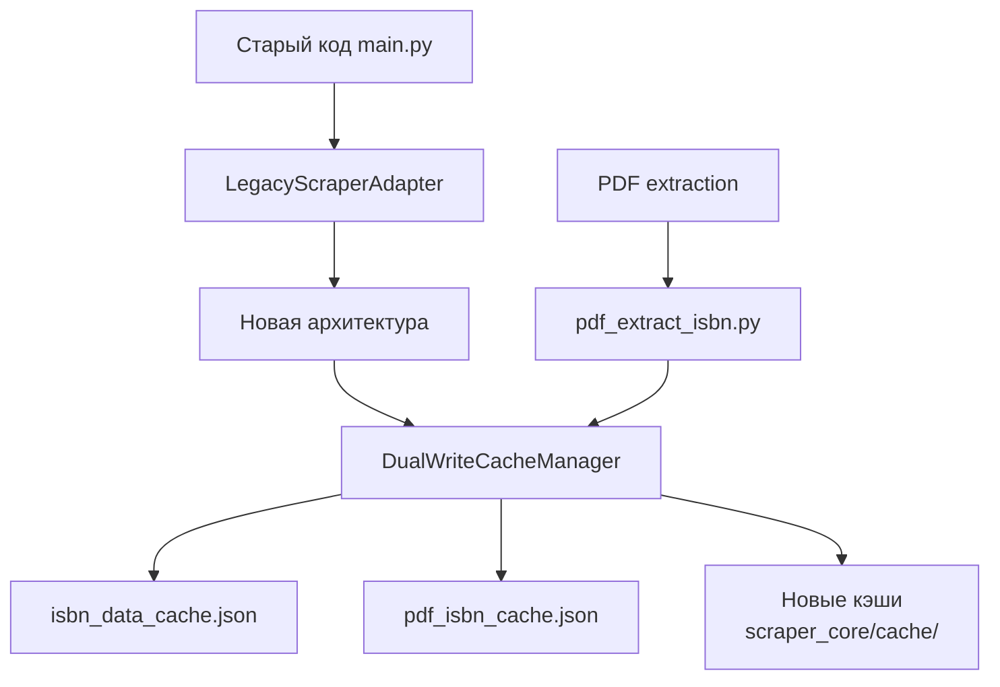

# План реализации Итерации C: Интеграция и миграция

## Обзор
Итерация C фокусируется на интеграции новой архитектуры с существующим кодом и миграции данных. Основная цель - обеспечить плавный переход от старой системы к новой с сохранением обратной совместимости.

## Текущее состояние
- Итерация A (Базовый оркестрационный слой): Завершена частично (SearchCoordinator, LinkCollector реализованы)
- Итерация B (Управление вкладками и обработка ошибок): Завершена полностью
- Итерация C (Интеграция и миграция): Начата

## Задачи Итерации C

### 1. Адаптер для main.py (C.1.1)
**Статус**: Готово (существует `scraper_core/orchestrator/legacy_adapter.py`)

**Компоненты**:
- `LegacyScraperAdapter` - основной адаптер
- Функции-обертки для обратной совместимости:
  - `async_parallel_search()`
  - `process_isbn_async()`
  - `run_api_stage()`
  - `search_multiple_books()`

**Что нужно сделать**:
- [x] Проверить корректность работы адаптера
- [x] Интегрировать адаптер в `main.py` (опционально через импорт)
- [x] Обеспечить совместимость интерфейсов

### 2. Dual-write в isbn_data_cache.json (C.1.2)
**Статус**: Готово (требуется реализация)

**Требования**:
- При сохранении данных через новую архитектуру также записывать в старый кэш
- Формат данных должен соответствовать старому формату:
  ```json
  {
    "version": 1,
    "entries": {
      "9781835081167": {
        "title": "Hands-On Python for DevOps",
        "authors": ["Ankur Roy"],
        "source": "Open Library",
        "pages": null,
        "year": "2024"
      }
    }
  }
  ```

**Реализация**:
- [x] Создать модуль `scraper_core/integration/dual_write.py`
- [x] Реализовать класс `DualWriteCacheManager`
- [x] Добавить методы для записи в оба формата кэшей
- [x] Интегрировать с `LegacyScraperAdapter`

### 3. Dual-write в pdf_isbn_cache.json (C.1.3)
**Статус**: Готово (требуется реализация)

**Требования**:
- При извлечении ISBN из PDF сохранять результаты в старый кэш
- Формат данных:
  ```json
  {
    "version": 1,
    "entries": {
      "filename.pdf|filesize": {
        "isbn": "9781835081167",
        "source": "text",
        "mtime": 1765106992.0,
        "size": 13572839
      }
    }
  }
  ```

**Реализация**:
- [x] Расширить `DualWriteCacheManager` для работы с PDF кэшем
- [x] Интегрировать с модулем `pdf_extract_isbn.py`
- [x] Обеспечить обратную совместимость при загрузке кэша

### 4. Скрипты миграции данных (C.1.4)
**Статус**: Готово (частично существует `scraper_core/integration/migration.py`)

**Требуемые скрипты**:
1. **Миграция данных из старых кэшей**:
   - Конвертация `isbn_data_cache.json` в новый формат
   - Конвертация `pdf_isbn_cache.json` в новый формат
   - Сохранение мигрированных данных

2. **Проверка согласованности**:
   - Сравнение данных в старых и новых кэшах
   - Выявление расхождений
   - Генерация отчета

3. **Очистка дубликатов**:
   - Удаление устаревших записей
   - Объединение дублирующихся данных

**Реализация**:
- [x] Создать `scripts/migrate_caches.py`
- [x] Создать `scripts/validate_consistency.py`
- [x] Создать `scripts/cleanup_duplicates.py`

### 5. Тестирование обратной совместимости (C.1.5)
**Статус**: Готово (существуют тесты в `tests/test_orchestrator_integration.py`)

**Тестовые сценарии**:
1. **Функциональное тестирование**:
   - Работа `async_parallel_search` через адаптер
   - Корректность данных в результатах
   - Обработка ошибок

2. **Интеграционное тестирование**:
   - Запуск полного цикла через `main.py`
   - Проверка dual-write механизма
   - Сравнение производительности

3. **Тестирование миграции**:
   - Корректность конвертации данных
   - Сохранение всех полей
   - Обработка edge cases

**Реализация**:
- [x] Расширить существующие тесты
- [x] Добавить тесты для dual-write
- [x] Создать интеграционные тесты

### 6. Документация и отчетность
**Статус**: В процессе

**Документы для обновления**:
- [ ] `PROGRESS.md` - добавить запись о завершении итерации C
- [ ] `MIGRATION_GUIDE.md` - добавить раздел по dual-write и миграции кэшей
- [ ] `CONCEPTION.md` - обновить архитектурную схему
- [ ] `TODO.md` - обновить статус итерации C

## Архитектурная схема dual-write



## Порядок выполнения

### Фаза 1: Подготовка (1-2 дня)
1. Анализ текущих кэшей и их структуры
2. Проектирование dual-write механизма
3. Создание тестовых данных

### Фаза 2: Реализация (3-5 дней)
1. Реализация `DualWriteCacheManager`
2. Интеграция dual-write с адаптером
3. Создание скриптов миграции

### Фаза 3: Тестирование (2-3 дня)
1. Функциональное тестирование
2. Интеграционное тестирование
3. Тестирование производительности

### Фаза 4: Документация и финализация (1-2 дня)
1. Обновление документации
2. Создание отчетов
3. Подготовка к следующей итерации

## Критерии успеха

### Технические критерии
1. **Функциональность**: Все функции старого кода работают через адаптер
2. **Совместимость**: Dual-write корректно записывает в оба формата кэшей
3. **Производительность**: Нет значительного снижения производительности
4. **Надежность**: Миграция данных проходит без потерь

### Бизнес-критерии
1. **Плавный переход**: Существующие процессы не прерываются
2. **Сохранение данных**: Все исторические данные доступны
3. **Простота поддержки**: Новая система проще в расширении

## Риски и митигация

| Риск | Вероятность | Влияние | Митигация |
|------|-------------|---------|-----------|
| Несовместимость форматов данных | Средняя | Высокое | Тщательное тестирование, fallback механизмы |
| Потеря данных при миграции | Низкая | Критическое | Резервное копирование, валидация |
| Снижение производительности | Средняя | Среднее | Оптимизация, кэширование |
| Ошибки в dual-write | Высокая | Высокое | Подробное логирование, мониторинг |

## Следующие шаги после Итерации C

1. **Итерация D**: Оптимизация и production-готовность
   - Оптимизация кэширования
   - Система метрик и мониторинга
   - Нагрузочное тестирование

2. **A/B тестирование**: Параллельный запуск старой и новой системы
3. **Полная миграция**: Перевод всех процессов на новую архитектуру

## Заключение

Итерация C является критически важным этапом перехода на новую архитектуру. Успешная реализация обеспечит плавную миграцию без нарушения работы существующей системы и создаст основу для дальнейших оптимизаций в Итерации D.

Ключевые факторы успеха:
1. Тщательное тестирование обратной совместимости
2. Надежный механизм dual-write
3. Полная документация процессов миграции
4. Активное мониторинг во время внедрения