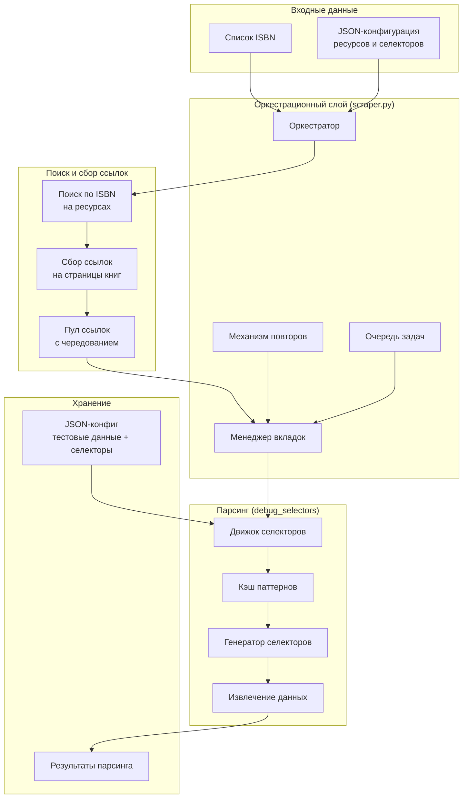

# Переработанная архитектура интеграции debug_selectors в scraper

## Анализ комментариев пользователя

### 1. Полная замена селекторов из resources.py
- **Текущее состояние**: `resources.py` содержит жестко закодированные CSS/XPath селекторы для каждого ресурса
- **Цель**: Заменить все селекторы на динамически генерируемые паттерны из `debug_selectors.py`
- **Сохранить в resources.py**: Только информацию о страницах поиска и базовые настройки ресурсов

### 2. Превращение scraper.py в оркестрационный слой
- **Текущая роль**: Парсинг страниц с книгами с использованием жестких селекторов
- **Новая роль**: 
  - Управление процессом скрапинга (ISBN → поиск → сбор ссылок → распределение запросов)
  - Управление вкладками ChromeDriver
  - Обработка блокировок и повторных попыток
  - Передача данных в `debug_selectors` для парсинга

### 3. JSON-конфигурация для тестовых данных и селекторов
- **Текущее состояние**: Тестовые данные встроены в код `debug_selectors.py`
- **Цель**: Вынести в отдельный JSON-файл для легкого обновления и управления

### 4. Автоматический выбор готовых селекторов
- **Текущая реализация**: В `debug_selectors.py` есть механизм выбора лучшего паттерна
- **Цель**: Интегрировать этот механизм в основной процесс скрапинга

### 5. Генерация недостающих селекторов
- **Текущая реализация**: `generate_pattern()` создает селекторы из тестовых данных
- **Цель**: Автоматически генерировать недостающие селекторы при наличии тестовых данных

## Новая архитектура системы



## Компоненты системы

### 1. JSON-конфигурация (`resources_config.json`)
```json
{
  "resources": {
    "chitai-gorod": {
      "search_url": "https://www.chitai-gorod.ru/search",
      "search_params": {"q": "{isbn}"},
      "test_data": [
        {
          "url": "https://www.chitai-gorod.ru/product/...",
          "fields": {
            "title": "Название книги",
            "author": "Автор книги", 
            "pages": "300",
            "year": "2023"
          }
        }
      ],
      "selectors": {
        "title": ["css:.product-title", "xpath://h1[@class='title']"],
        "author": ["css:.product-author a", "xpath://div[@class='author']/a"],
        "pages": ["css:.product-pages", "xpath://span[@class='pages']"],
        "year": ["css:.product-year", "xpath://span[@class='year']"]
      },
      "settings": {
        "delay_range": [1.0, 3.0],
        "max_tabs": 3,
        "retry_attempts": 2
      }
    }
  }
}
```

### 2. Оркестрационный слой (`scraper_orchestrator.py`)
- **ISBN Processor**: Обработка списка ISBN, нормализация
- **Search Coordinator**: Координация поиска по разным ресурсам
- **Link Collector**: Сбор всех доступных ссылок на страницы книг
- **Tab Manager**: Управление пулом вкладок ChromeDriver
- **Task Queue**: Распределение задач между ресурсами с чередованием
- **Retry Handler**: Обработка блокировок и неудачных загрузок

### 3. Движок селекторов (`selector_engine.py`)
- **Pattern Cache**: Кэширование сгенерированных селекторов
- **Selector Matcher**: Автоматический выбор лучшего селектора из доступных
- **Pattern Generator**: Генерация новых селекторов из тестовых данных
- **Data Extractor**: Извлечение данных с использованием выбранных селекторов

### 4. Обновленный `resources.py`
- Только конфигурация ресурсов (URL, параметры поиска)
- Загрузка JSON-конфигурации
- Интерфейс для доступа к настройкам ресурсов

## Преимущества новой архитектуры

1. **Гибкость**: Легко добавлять новые ресурсы через JSON-конфиг
2. **Устойчивость**: Автоматическая генерация селекторов при изменении верстки
3. **Масштабируемость**: Чередование запросов между ресурсами снижает нагрузку
4. **Поддерживаемость**: Все селекторы в одном месте (JSON), а не разбросаны по коду
5. **Тестируемость**: Тестовые данные интегрированы в конфигурацию

## Миграция с текущей архитектуры

1. **Этап 1**: Создание JSON-конфигурации на основе текущих тестовых данных
2. **Этап 2**: Рефакторинг `debug_selectors.py` для работы с JSON-конфигом
3. **Этап 3**: Преобразование `scraper.py` в оркестрационный слой
4. **Этап 4**: Удаление жестких селекторов из `resources.py`
5. **Этап 5**: Интеграция и тестирование всей системы

## Риски и митигация

| Риск | Вероятность | Влияние | Митигация |
|------|-------------|---------|-----------|
| Потеря точности при генерации селекторов | Средняя | Высокое | Сохранение ручной проверки, механизм fallback к старым селекторам |
| Увеличение времени парсинга | Низкая | Среднее | Кэширование селекторов, параллельная обработка |
| Сложность отладки JSON-конфигов | Средняя | Низкое | Валидация схемы, инструменты для проверки |
| Блокировки ресурсов при чередовании | Высокая | Высокое | Динамические задержки, ротация User-Agent |

## Критерии успеха

1. **Функциональность**: Все текущие ресурсы (Читай-город, Book.ru, РГБ) работают с новой архитектурой
2. **Точность**: Точность извлечения данных не ниже 95% по сравнению с текущей системой
3. **Производительность**: Время парсинга не увеличивается более чем на 20%
4. **Поддерживаемость**: Добавление нового ресурса занимает не более 30 минут
5. **Надежность**: Система устойчива к блокировкам и изменениям верстки