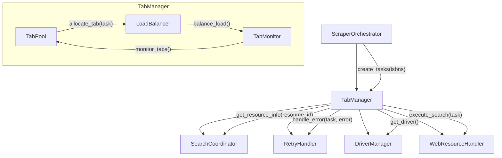

# Схема взаимодействия TabManager с другими компонентами

## Обзор архитектуры

TabManager управляет вкладками браузера для параллельного скрапинга. Он взаимодействует с:
- **ScraperOrchestrator** - основной оркестратор, который делегирует задачи TabManager
- **SearchCoordinator** - для получения информации о ресурсах и их приоритетах
- **RetryHandler** - для обработки ошибок и повторных попыток
- **DriverManager** (будущий) - для управления драйверами браузера

## Диаграмма взаимодействия



## Интерфейсы компонентов

### TabManager Interface

```python
class TabManagerInterface:
    """Интерфейс для управления вкладками браузера."""
    
    async def initialize(self, max_tabs: int, driver) -> None:
        """Инициализация менеджера вкладок."""
        pass
    
    async def create_tabs(self, tasks: List[ScrapingTask]) -> List[TabInfo]:
        """Создание вкладок для задач."""
        pass
    
    async def execute_tasks(self, tasks: List[ScrapingTask]) -> List[Dict[str, Any]]:
        """Выполнение задач через вкладки."""
        pass
    
    async def close_tabs(self) -> None:
        """Закрытие всех вкладок."""
        pass
    
    def get_tab_status(self) -> Dict[str, Any]:
        """Получение статуса всех вкладок."""
        pass
    
    async def balance_load(self) -> None:
        """Балансировка нагрузки между вкладками."""
        pass
```

### RetryHandler Interface

```python
class RetryHandlerInterface:
    """Интерфейс для обработки ошибок с повторными попытками."""
    
    def __init__(self, max_retries: int = 3, base_delay: float = 1.0):
        pass
    
    async def execute_with_retry(
        self, 
        func: Callable, 
        *args, 
        **kwargs
    ) -> Any:
        """Выполнение функции с повторными попытками."""
        pass
    
    def should_retry(self, error: Exception) -> bool:
        """Определение, стоит ли повторять попытку."""
        pass
    
    def get_next_delay(self, attempt: int) -> float:
        """Получение задержки для следующей попытки (экспоненциальный backoff)."""
        pass
```

## Взаимодействие с SearchCoordinator

TabManager использует SearchCoordinator для:
1. Получения информации о ресурсах (URL шаблоны, приоритеты)
2. Определения оптимального порядка использования ресурсов
3. Обновления статистики использования ресурсов

```python
# Пример взаимодействия
class TabManager:
    def __init__(self, search_coordinator: SearchCoordinator):
        self.search_coordinator = search_coordinator
    
    async def get_resource_for_task(self, task: ScrapingTask) -> ResourceConfig:
        """Получение конфигурации ресурса для задачи."""
        resource_id = self.search_coordinator.get_next_resource(
            task_isbn=task.isbn,
            tried_resources=task.tried_resources
        )
        return self.search_coordinator.get_resource_config(resource_id)
```

## Взаимодействие с ScraperOrchestrator

1. **ScraperOrchestrator** создает задачи скрапинга
2. **TabManager** получает задачи и распределяет их по вкладкам
3. **TabManager** возвращает результаты в **ScraperOrchestrator**
4. **ScraperOrchestrator** обрабатывает результаты и обновляет статистику

```python
# В ScraperOrchestrator
async def scrape_isbns(self, isbns: List[str]) -> List[Dict[str, Any]]:
    # Создание задач
    tasks = self._create_tasks(isbns)
    
    # Использование TabManager для выполнения
    if self.tab_manager:
        results = await self.tab_manager.execute_tasks(tasks)
    else:
        # Старая логика
        results = await self._execute_tasks_without_tabs(tasks)
    
    return results
```

## Обработка ошибок через RetryHandler

```python
class TabManager:
    def __init__(self, retry_handler: RetryHandlerInterface):
        self.retry_handler = retry_handler
    
    async def execute_task_with_retry(self, task: ScrapingTask) -> Dict[str, Any]:
        """Выполнение задачи с обработкой ошибок."""
        async def _execute():
            return await self._execute_single_task(task)
        
        try:
            result = await self.retry_handler.execute_with_retry(_execute)
            task.status = TaskStatus.COMPLETED
            task.result = result
            return result
        except Exception as e:
            task.status = TaskStatus.FAILED
            task.error = str(e)
            raise
```

## Мониторинг и балансировка

TabManager включает компоненты для:
1. **Мониторинга состояния вкладок** - отслеживание времени выполнения, ошибок
2. **Балансировки нагрузки** - перераспределение задач между вкладками
3. **Восстановления после сбоев** - перезапуск зависших вкладок

## Конфигурация

```yaml
tab_manager:
  max_tabs: 5
  tab_switch_delay: 0.2
  monitor_interval: 1.0
  load_balancing_threshold: 0.8
  
retry_handler:
  max_retries: 3
  base_delay: 1.0
  max_delay: 30.0
  retryable_errors:
    - "TimeoutException"
    - "WebDriverException"
    - "ConnectionError"
```

## Следующие шаги

1. Реализовать базовый TabManager с поддержкой создания вкладок
2. Интегрировать с SearchCoordinator для получения информации о ресурсах
3. Добавить RetryHandler для обработки ошибок
4. Реализовать мониторинг состояния вкладок
5. Добавить балансировку нагрузки
6. Написать тесты для всех компонентов